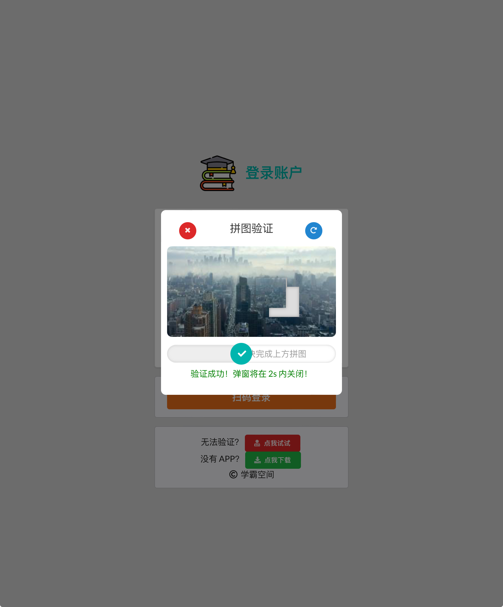
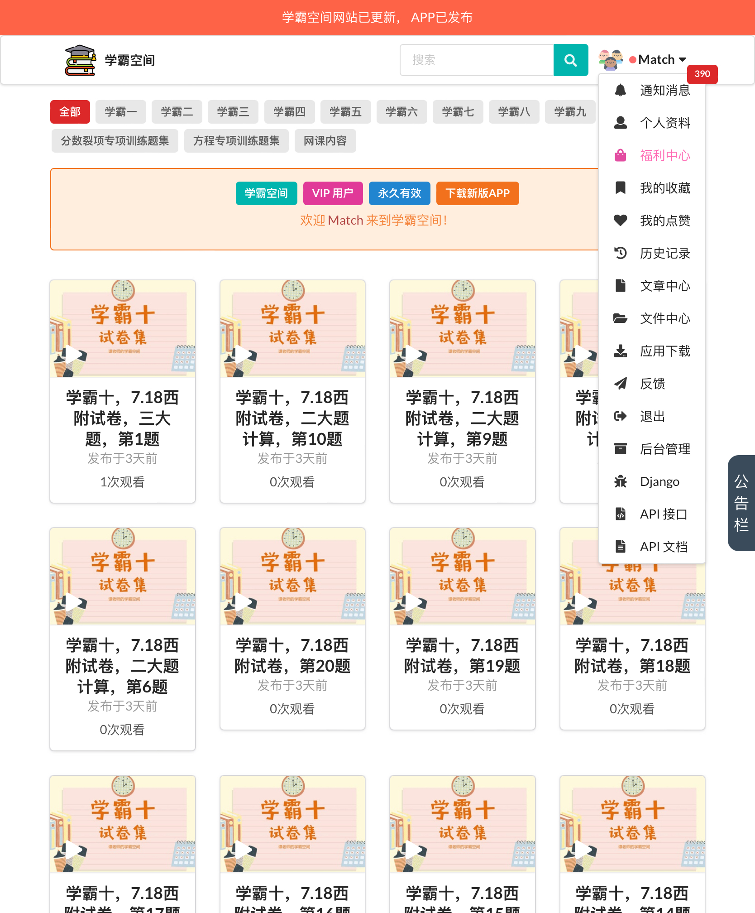

# Xueba web   
a Video-On-Demand Website Based on Django
- **REST API** for [Xueba APP](https://github.com/dadaWilliam/xueba) 


## Project Features

This project is divided into a frontend and a backend.

### Frontend Features

- Video List Display
- Video Playback Details
- Detail Comments
- Personal Center
- Article
- File Download
- History
- Likes and Collects
- Notifications

### Backend Features

- Video Management
- Comment Management
- User Management
- Feedback Management

## Technology Stack

- Python
- Django
- Nginx
- Semantic-CSS
- jQuery
- HTML

## Prerequisites
Ensure you have Python and Django installed on your system. 

## Installation
To set up this Django-based video-on-demand website locally, follow these steps:

1. **Clone the Repository**:
   ```sh
   git clone https://github.com/dadaWilliam/videoproject.git
2. **Navigate to the Project Directory**:
   ```sh
   cd videoproject
3. **Set SECRET_KEY in `videoproject/videoproject/settings`**:
   ```sh
   # SECURITY WARNING: keep the secret key used in production secret!
   SECRET_KEY = 'test'
4. **Install Required Packages**:
   ```sh
   pip install -r requirements.txt
5. **Run the Development Server**:
    ```sh
   python manage.py runserver
6. **Access the Application**:
Open your web browser and visit `http://localhost:8000`.

### 项目名称
基于django的视频点播网站开发

### 项目功能
本项目分为前台和后台

前台功能
- 视频列表展示
- 视频播放详情
- 详情评论
- 个人中心

后台功能
- 视频管理
- 评论管理
- 用户管理
- 反馈管理

### 技术栈
python/django/nginx/semantic-css/jquery/html
